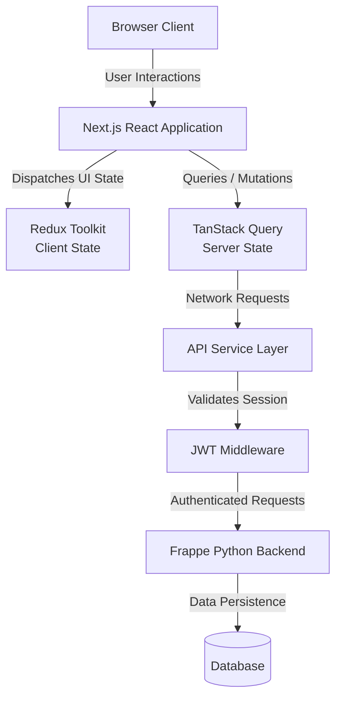

# Access to Credit System

## Overview
The Access to Credit System is a production frontend application built to handle the end-to-end loan application and lead management process. It is designed with performance, type safety, and maintainability as primary constraints.

## Architecture
The application is built on Next.js using the App Router. It implements a repository pattern for data fetching, centralizing API interactions through an abstraction layer.

State is divided into two distinct domains:
1. Server State: Managed by TanStack Query for caching, data synchronization, and optimistic UI updates.
2. Client State: Managed by Redux Toolkit for complex UI interactions, wizard state progression, and global connectivity monitoring.

## System Flow



## Technology Stack
- Core: Next.js 16, React 19
- Language: TypeScript 6 (Strict Mode)
- State Management: Redux Toolkit, TanStack Query
- Styling: Tailwind CSS, class-variance-authority, clsx
- Mocking: Mock Service Worker (MSW)

## Folder Structure
The codebase follows a feature-based architecture within the `src/` directory to maximize modularity and maintainability:

- **`app/`**: Next.js App Router routing infrastructure (pages, nested layouts, `loading.tsx`, error boundaries, and API route proxies).
- **`components/`**: Reusable, generic, and unstyled UI primitive components (buttons, inputs, modals, layout wrappers) used across the application.
- **`features/`**: The core of the application domain logic. Each feature (e.g., `leads`, `loans`, `new-lead`, `auth`) contains its own:
  - `components/`: Domain-specific components.
  - `api/`: API service functions and data fetchers.
  - `store/`: Redux slices for client state.
  - `hooks/`: Feature-specific custom React hooks.
  - `types/`: Domain-specific TypeScript interfaces.
- **`lib/`**: Shared utilities, pure helper functions, constant definitions, and global configurations (e.g., global API clients, date formatters).
- **`mocks/`**: Mock Service Worker (MSW) handlers and configurations for local development and testing without a live backend.
- **`store/`**: Global Redux store configuration, root reducer composition, and middleware setup.
- **`styles/`**: Global stylesheets, SCSS files, and customized Tailwind CSS configurations (like `main-layout.scss`).

## Setup and Development

Requires Node.js and a package manager (npm or pnpm recommended).

1. Environment Configuration:
```bash
cp .env.example .env.local
```

2. Install dependencies:
```bash
npm install
```

3. Start the development environment:
```bash
npm run dev
```

Run TypeScript validation:
```bash
npm run typecheck
```

Build for production:
```bash
npm run build
```

## Key Modules
- Loan Application Wizard: A modular, feature-based architecture managing multi-step form data collection and submission.
- Lead Management Dashboard: A centralized interface for tracking leads with real-time state synchronization.
- Authentication Middleware: Route protection and session validation via Next.js server logic.
